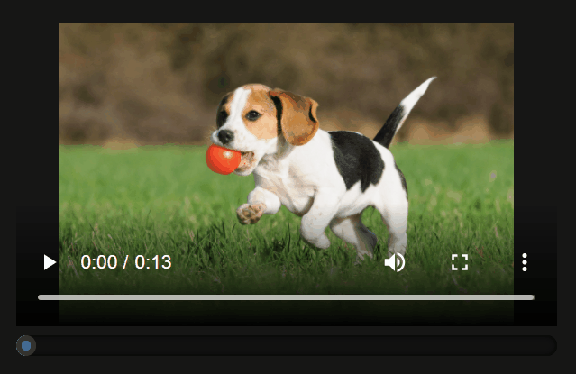

# Build a custom video scrubber with Cloudinary and Nuxt.js


> Find the [final demo on codesandbox](https://codesandbox.io/s/github/haxordx/cloudinary-nuxt-video-scrubber)

Nuxt is a static-site generator that upgrades the modularity of Vue.js for full-fledged web applications. Nuxt helps developers create fast and SEO optimized single page applications. We often see Nuxt powering blogs and other text based sites.

But it doesn't end there! As Nuxt is based on Vue.js, there's no reason to be limited to text. This tutorial will demonstrate how you can extend Nuxt to serve and control video content with the [Cloudinary Video player](https://demo.cloudinary.com/video-player/). 

Cloudinary is an API for hosting and transforming image and video content. It's a great choice for a Nuxt project as you're guaranteed fast delivery. It's all about speed here. Cloudinary even has a handful of prebuilt Vue components you can use to modify your videos without a back end! 

## Project Set Up

First, create a new Nuxt app. The `nuxt-app` package is the [recommended](https://nuxtjs.org/docs/2.x/get-started/installation/) way to start a new project. In your console, run the following command:

```sh
yarn create nuxt-app cloudinary-vue-nuxt
```

Then follow the interactive prompts. You can find the options used for this demo below.

```sh
ianjennings@Gibson:~/Development-Unix$ yarn create nuxt-app cloudinary-vue-nuxt

create-nuxt-app v3.6.0
✨  Generating Nuxt.js project in cloudinary-vue-nuxt

? Project name: cloudinary-vue-nuxt
? Programming language: JavaScript
? Package manager: Npm
? UI framework: None
? Nuxt.js modules: (Press <space> to select, <a> to toggle all, <i> to invert selection)
? Linting tools: (Press <space> to select, <a> to toggle all, <i> to invert selection)
? Testing framework: None
? Rendering mode: Universal (SSR / SSG)
? Deployment target: Static (Static/Jamstack hosting)
? Development tools: (Press <space> to select, <a> to toggle all, <i> to invert selection)
? What is your GitHub username? ianjennings
? Version control system: Git
```

Now that you have a clean Nuxt project, you should be able to use the `dev` command to run the project:

```sh
yarn dev
```

This will create a development server on `localhost:3000` where you can preview your changes.

## Install the Cloudinary Nuxt Package

Now it's time to add Cloudinary to the mix. You can find the [full install guide here](https://cloudinary.nuxtjs.org/setup).

You may need to install some additional dependencies to get everything working.

```
yarn add  @babel/runtime-corejs2
yarn add @soda/get-current-script
```

In your `nuxt.config.js`, be sure to include `useComponent: true` in addition to your Cloudinary credentials. This will tell Nuxt.js to include components from the [Cloudinary Vue SDK](https://cloudinary.com/documentation/vue_video_manipulation). 

```js
export default {
  // ...
  // Modules: https://go.nuxtjs.dev/config-modules
  modules: [
    '@nuxtjs/cloudinary'
  ],
  cloudinary: {
    cloudName: 'demo',
    apiKey: 'demo',
    apiSecret: 'demo',
    useComponent: true
  }
  //...
}
```

## Create the custom Cloudinary Video component


Then, make a new component for your video player. This is where you'll build the custom video scrubber.

`components/CloudinaryVideo.vue`
```html
<template>
  <div>
    <h1>Hello, world!</h1>

    <cld-video 
      cloudName="demo" 
      publicId="dog" 
      controls="true">
    </cld-video>

  </div>
</template>
```

The `<cld-video>` component is [a video player provided by the Cloudinary Vue SDK](https://cloudinary.com/documentation/vue_video_manipulation#cldvideo_component). With it, you can perform dynamic video transformations right in Vue! To keep things simple, this tutorial will treat it as a simple video player.

## Keeping track of the video time


In order to show the proper scrub position, we need to know the current video time. This time is updated multiple times per second as a video plays.

In order to get the current video in Vue, create a reference to the dom element with `$ref`. In the `<video>` component, add `ref="video"`. Then, the DOM element can be accessed in Vue via `this.$refs.video.$videoElement`.

This `<video>` element has [a method called `onTimeUpdate`](https://www.w3schools.com/jsref/event_ontimeupdate.asp) you can use to get notified of a time change. Then, store that time as a `data` variable.

1. Create a `data` variable called `currentTime`
1. Bind to the `<video>` `onTimeUpdate` event
1. Update data `current` time with the value from the event
1. Render the `currentTime` in the dom

You can see everything come together below:

`components/CloudinaryVideo.vue`
```html
<template>
  <div>
    <h1>Current Time: {{ currentTime }}</h1>

    <cld-video
      cloudName="demo"
      publicId="dog"
      controls="true"
      ref="video"
    ></cld-video>
  </div>
</template>

<script>
export default {
  data() {
    return {
      currentTime: 0,
      duration: 0,
    };
  },
  methods: {
    onTimeUpdate(event) {
      this.currentTime = 
        this.$refs.video.$videoElement.currentTime;
    },
  },
  mounted: function () {
    this.$refs.video.$videoElement.addEventListener(
      "timeupdate", this.onTimeUpdate
    );
  },
};
</script>
```

## Controlling Video Time

Now that the current time is displayed, there needs to be a way to change it. The slider needs to both render and control the video time.

So how will the video be controlled? Start manipulating the `<video>` time by creating a simple `<button>`.

```html
<button v-on:click="setVideoTime(5)">Go to 0:05</button>
```

The `setVideoTime()` method will set the `currentTime` of the video.

```js
setVideoTime(timestamp) {
  this.$refs.video.$videoElement.currentTime = timestamp;
}
```

Now when the button is pressed, it will seek the video to the 5 second mark.


That's the basis of it! The current video time can be displayed and controlled!

## Getting the video duration

The next step is to make a slider. The slider has three properties:

- Minimum
- Value
- Maximum

The slider **minimum** will be `0` as that represents the beginning of the video. 

The **value** will be `currentTime` as gathered in the previous steps.

What about the **maximum**? This should be the video duration, which doesn't exist in memory yet.

To get the video duration, another event listener is bound to the `loadedmetadata` event. This is fired when the video has been loaded by the browser and the metadata (like duration!) is available.

```js
this.$refs.video.$videoElement.addEventListener(
  "loadedmetadata",
  this.onLoadedMetadata
);
```

When that event is fired, the `onLoadedMetadata` callback will get the video duration from the `$videoElement` as seen in previous steps.

```js
onLoadedMetadata(event) {
  this.duration = this.$refs.video.$videoElement.duration;
},
```

## Creating the slider


Now for the slider. The [HTML range input](https://www.w3schools.com/howto/howto_js_rangeslider.asp) is a great tool for this, no UI specific JS needed!

Plug the **currentTime**, and **duration** into the input. For this step, bind the `:value` to the current time.

`components/CloudinaryVideo.vue`
```html
<input
  type="range"
  :min="0"
  :max="duration"
  :value="currentTime"
  class="slider"
/>
```

## Two-Way Binding (the wrong way)


You might notice that although the slider renders properly, interacting with it doesn't actually change the video.

In fact, if two way binding is attempted with `v-model` the video will begin to glitch. The video event fires, the slider updates and fires the event back to the video. So the video stutters.

This normally wouldn't be a problem, but the `ontimeupdate` event is fired so frequently (and the value so precise) that by the time the DOM is updated, it's outdated, forcing the redraw to happen again.

You can learn more about this behavior in [this Vue issue filed on GitHub](https://github.com/vuejs/vue/issues/10542#issuecomment-533642739).

## Two-Way Binding

To avoid the behavior found in the previous step, the l.

First, `currentTime` will become `currentTime_` to indicate that it is a virtual property. This property will cache the value of `currentTime` in memory to prevent too many updates from occurring.


```js
export default {
  data() {
    return {
      currentTime_: 0,
      duration: 0,
    };
  },
  //...
}
```

The `onTimeUpdate` function:

```js
onTimeUpdate(event) {
  this.currentTime_ = this.$refs.video.$videoElement.currentTime;
},
```

Then, a new `currentTime` will be created, but this will actually be a `computed` property.

```js
computed: {
  currentTime: {
    set(time) {
      this.setVideoTime(time);
    },
    get: ({ currentTime_ }) => currentTime_,
  },
}
```


The `set` method ensures that when `currentTime` is modified, it will behave normally.

However, when it comes time to react to `currentTime` updates via `get`, the cached `currentTime_` will be returned instead. 

In short, the video time can be set directly with `currentTime`, but only the cached `currentTime_` value is ever returned.

Now the `:value` binding can be changed to a two-way `v-model` binding.

```html
<input
  type="range"
  :min="0"
  :max="duration"
  v-model="currentTime"
  class="slider"
  id="myRange"
/>
```

That's it, the slider is responsive and can be dragged to change the video time!


## Two way binding!



Finally, add some style to the demo. Add the `<style>` 
tag to make the page dark and the slider a bit larger.

These styles were adopted from [this codepen](https://codepen.io/shashank_coder/pen/jOqxOpK). Try styling the slider yourself!

`components/CloudinaryVideo.vue`
```html
<style scoped>
video {
  width: 400px;
}
.slider {
  width: 400px;
  height: 15px;
  -webkit-appearance: none;
  background: #111;
  outline: none;
  border-radius: 15px;
  overflow: hidden;
  box-shadow: inset 0 0 5px rgba(0, 0, 0, 1);
}
.slider::-webkit-slider-thumb {
  -webkit-appearance: none;
  width: 15px;
  height: 15px;
  border-radius: 50%;
  background: #0069ff;
  cursor: pointer;
  border: 4px solid #333;
  box-shadow: -407px 0 0 400px #0069ff;
}
</style>
```

## Links

- [Cloudinary Video player](https://demo.cloudinary.com/video-player/)
- [Cloudinary Vue SDK](https://cloudinary.com/documentation/vue_video_manipulation)
- [Nuxt Install](https://nuxtjs.org/docs/2.x/get-started/installation/)
- [Vue `ontimeupdate` Behavior](https://github.com/vuejs/vue/issues/10542#issuecomment-533642739)
- [CodePen Slider Styles](https://codepen.io/shashank_coder/pen/jOqxOpK)
- [HTML range input](https://www.w3schools.com/howto/howto_js_rangeslider.asp)
